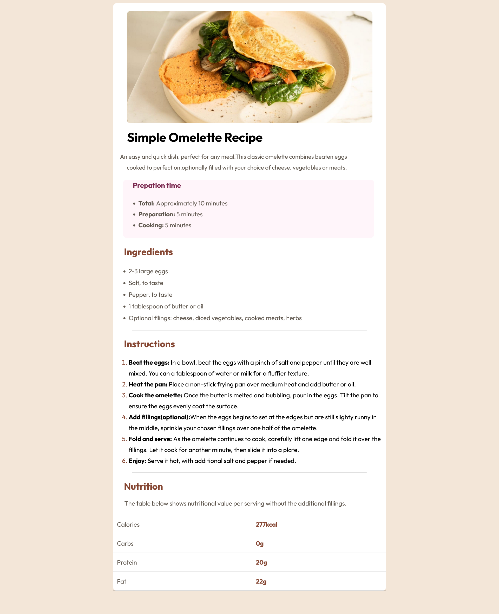

# MakeCodeLit - Recipe page solution

## Table of contents

- [Overview](#overview)
  - [The challenge](#the-challenge)
  - [Screenshot](#screenshot)
  - [Links](#links)

## Overview

## The challenge

### Screenshot

#### Links  

https://omelettereci.netlify.app/

https://github.com/Prayz-code/recipe

